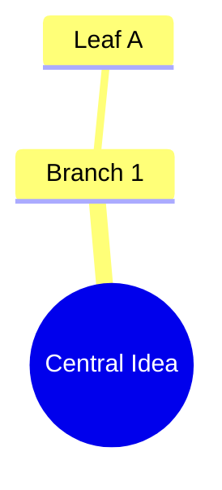

# Xubb Prompt Engineering Guide

**Version:** 2.2  
**Last Updated:** January 31, 2026  
**Status:** Production (xubb_agents v2.0 Compliant)

This guide is the **definitive reference** for creating prompts within the Xubb ecosystem. It covers everything from standard text generation to interactive widgets, autonomous agents, and RAG-augmented analysis.

---

## Revision History

| Version | Date | Changes |
|---------|------|---------|
| 2.2 | Jan 31, 2026 | **Critical fix:** Changed `message` → `content` in Agent Output Protocol to match v2.0 schema |
| 2.1 | Jan 31, 2026 | Updated prompt types (added `app`, `system`), enhanced Agent Output Protocol with v2.0 fields, clarified variable injection vs Jinja2 |
| 2.0 | Jan 2026 | Added v2.0 features: trigger_conditions, subscribed_events, Blackboard containers |
| 1.0 | Dec 2025 | Initial release |

---

## 1. Prompt Types Overview

Xubb supports **five** distinct prompt types, defined by the `type` field in the database:

| Type | Purpose | Behavior | User-Editable |
| :--- | :--- | :--- | :---: |
| **`insight`** | **Manual Analysis** | Triggered by user click. Generates specific outputs (summaries, charts, analysis) based on the transcript. | ✓ |
| **`agent`** | **Real-Time Assistant** | Runs autonomously in the background. Triggers based on rules (keywords, silence, events, intervals). | ✓ |
| **`app`** | **Application Infrastructure** | Core system templates for Q&A, summaries, and series analysis. Used by built-in features. | ✓ |
| **`system`** | **Global Behavior** | Language directives, user context injection, and other global LLM instructions. Hidden from standard UI. | ✗ |

> **Note:** The legacy `summary` and `qa` types have been consolidated into `app` as of v2.1. Existing prompts with these types will continue to work but should be migrated.

### Type Distribution (Current)

```
agent   │████████████████████████████████│ 29
insight │████████████████████████████████████████████████████████████████│ 65
app     │█████│ 5  (Q&A templates + Auto-Summary + Series Evolution)
system  │████│ 4  (Language directives, user context)
```

### When to Use Each Type

| Use Case | Recommended Type |
|----------|------------------|
| Real-time coaching during calls | `agent` |
| Post-call analysis (user-triggered) | `insight` |
| Charts, diagrams, reports | `insight` |
| Q&A templates (session/series/global) | `app` |
| Auto-summary generation | `app` |
| Language/localization control | `system` |

---

## 2. Core Concepts & Variables

### Variable Injection Systems

Xubb uses **two different templating systems** depending on the prompt type:

#### A. Standard Placeholders (Insights, Q&A, Summaries)
Simple curly-brace placeholders replaced by the backend before LLM execution:

| Placeholder | Description | Used In |
|-------------|-------------|---------|
| `{TRANSCRIPT}` | Conversation history (auto-truncated to fit context window) | All types |
| `{HISTORY}` | Summaries of previous sessions in a series | Series summaries |
| `{question}` | The user's specific question | Q&A prompts |

**Example:**
```text
Answer the user's question based on the provided context.

CONTEXT:
{TRANSCRIPT}

Question: {question}
```

#### B. Jinja2 Templates (Agents with Blackboard Access)
Agents that need to read Blackboard state use **Jinja2 syntax** (`{{ variable }}`):

| Syntax | Description | Example |
|--------|-------------|---------|
| `{{ state.var_name }}` | Read a Blackboard variable | `{{ state.sentiment }}` |
| `{{ state.session_goals }}` | Read session goals array | `{{ state.session_goals }}` |
| `{{ state.completed_goals }}` | Read completed goals | `{{ state.completed_goals }}` |

**Example (Goals Tracker Agent):**
```text
INPUT DATA:
- Session Goals: {{ state.session_goals }}
- Previously Completed: {{ state.completed_goals }}

Identify which goals are now completed based on the transcript.
```

> **Important:** Do NOT mix both systems in the same prompt. Use `{TRANSCRIPT}` for standard prompts, and `{{ state.* }}` for agents that need Blackboard access.

### Context Injection
The system automatically prepends context if `include_context: true` is set in the prompt configuration. This includes:
*   **User Profile (Cognitive Frame):** Identity, Core Goal, Expertise, and Audio/Mic context.
*   **Session Metadata:** Name, Classification, Custom Context (e.g., "This is a job interview").
*   **RAG Documents:** Relevant excerpts from attached files (PDFs, text) if RAG is enabled.

**Example of Final Prompt Construction:**
```text
SYSTEM MESSAGE:
[User Profile & Cognitive Frame Injected Here]
- User: Enrique (CEO)
- Goal: Secure the deal
- Mic Mode: Headset (User is SPEAKER_00)

CONTEXT/METADATA:
This is a high-stakes negotiation with Acme Corp.

RELEVANT DOCUMENTS:
[Excerpt from Pricing_Policy.pdf]
...

TRANSCRIPT:
Speaker A: Hello...
Speaker B: Hi...

[Your Prompt Text Here]
```

---

## 3. Rich Insights (Widgets & Visualization)

Rich prompts generate structured data (JSON, Mermaid, HTML) instead of plain text. The frontend uses the `model_config` metadata to decide how to render the output.

### The `model_config` Schema
To enable widgets, adding the `output` object to `model_config` is mandatory:

```json
"model_config": {
    "model": "gpt-4o",  // Recommended for structured output
    "temperature": 0.2, // Keep low (0.1-0.3) for strict syntax
    "output": {
        "format": "chart",  // OPTIONS: "text", "chart", "diagram", "list", "html"
        "schema": "chartjs" // Optional descriptor
    }
}
```

### A. Charts (Chart.js)
**Renderer:** Chart.js (Bar, Line, Pie, Radar, Scatter)
**Format:** Raw JSON.

**Prompt Instruction:**
> "Return ONLY valid JSON. No Markdown formatting. No \`\`\`json blocks."

**Example Output (Radar Chart):**
```json
{
  "type": "radar",
  "data": {
    "labels": ["Budget", "Authority", "Need", "Timing"],
    "datasets": [{ "data": [8, 5, 9, 4], "backgroundColor": "rgba(54, 162, 235, 0.2)" }]
  }
}
```

### B. Diagrams (Mermaid.js)
**Renderer:** Mermaid.js (Flowchart, Sequence, Gantt, Mindmap)
**Format:** Plain text Mermaid syntax.

**Prompt Instruction:**
> "Return ONLY valid Mermaid.js syntax. Do not use Markdown blocks."

**Example Output (Mindmap):**


### C. Interactive Lists
**Renderer:** Native Checklist Widget
**Format:** JSON Array of Objects.

**Prompt Instruction:**
> "Return a JSON List of objects. Schema: `[{ "text": "...", "priority": "high", "checked": false }]`"

### D. HTML Reports
**Renderer:** Browser DOM (Sanitized)
**Format:** Raw HTML String (Inline CSS).

**Prompt Instruction:**
> "Return raw HTML only. Use inline CSS for styling."

### E. System Prompts (Global Behavior)
Xubb supports dynamic system prompts that control global behavior, such as language output and user personalization.

**Available System Prompts:**
*   `system-language-directive`: Forces a specific language (e.g. "es").
*   `system-language-match`: Forces the LLM to detect and match the input language.
*   `system-user-context`: Injects the **Deep Impact** User Profile (Identity, Goals, Mic Context).

**Configuration:**
This is handled via `model_config` settings in the Session or Global Settings. However, prompts should generally be language-agnostic in their core logic.

**Exceptions:**
The system prompts explicitly instruct the LLM **NOT** to translate technical keys (JSON keys, Mermaid syntax) to prevent breaking the widgets.

---

## 4. Agent Personas (Autonomous Bots) — v2.0

Agents are prompts that run automatically. They require a `trigger_config` to decide *when* to run.

### Trigger Configuration
```json
"trigger_config": {
    "mode": "keyword",           // Can be a String OR List: ["keyword", "turn_based"]
    "keywords": ["price"],       // Required for 'keyword' mode
    "cooldown": 10,              // Seconds to wait before firing again
    "subscribed_events": [],     // NEW (v2.0): Events to subscribe to for 'event' mode
    "silence_threshold": 5       // Seconds for 'silence' mode
},
"trigger_conditions": {          // NEW (v2.0): Preconditions to skip unnecessary LLM calls
    "mode": "all",               // "all" (AND) or "any" (OR)
    "rules": [
        {"var": "phase", "op": "eq", "value": "negotiation"}
    ]
},
"priority": 5                    // Higher number = higher priority for state conflicts
```

### Modes Explained
1.  **`turn_based`**: Runs after every new transcript segment. Expensive but comprehensive.
2.  **`keyword`**: Runs ONLY if specific words are detected. Fast and efficient.
3.  **`silence`**: Runs if nobody speaks for `silence_threshold` seconds.
4.  **`interval`**: Runs every `trigger_interval` seconds.
5.  **`event`** (NEW v2.0): Runs when another agent emits a specific Blackboard event.

**Advanced Tip:** You can combine modes! Set `"mode": ["keyword", "turn_based"]` to trigger on specific words OR every turn (useful for high-priority monitors).

### Trigger Conditions (v2.0)
Agents can define preconditions that must be satisfied before they run. This prevents unnecessary LLM calls:
```json
"trigger_conditions": {
    "mode": "all",
    "rules": [
        {"var": "phase", "op": "in", "value": ["negotiation", "closing"]},
        {"var": "sentiment", "op": "gte", "value": 0.5},
        {"fact": "budget", "op": "exists"}
    ]
}
```

**Note:** Response caching was removed in v2.0. Cooldowns and trigger conditions are more correct mechanisms.

### Agent Context Tuning
Control how much history the agent sees to save tokens.

```json
"model_config": {
    "model": "gpt-4o-mini",
    "context_turns": 6 // Number of recent conversation turns to include (Default: 6)
}
```

### Agent Output Protocol (v2.0)

Agents must return a JSON object conforming to the **Agent Output Protocol**. The orchestrator parses this response to determine what to display and what state to update.

#### Core Response Schema

```json
{
  "has_insight": true,
  "type": "suggestion",
  "content": "Your short advice here (max 15 words)",
  "confidence": 0.85,
  "expiry": 30
}
```

#### Field Reference

| Field | Type | Required | Description |
|-------|------|----------|-------------|
| `has_insight` | boolean | **Yes** | `true` = display to user, `false` = silent (state-only) |
| `type` | string | If `has_insight: true` | Display style: `"suggestion"`, `"warning"`, `"fact"`, `"praise"` |
| `content` | string | If `has_insight: true` | The insight text (keep under 15 words) |
| `confidence` | float | No | 0.0-1.0 confidence score (used for filtering/ranking) |
| `expiry` | int | No | Seconds until insight auto-dismisses (default: persistent) |
| `variable_updates` | object | No | Key-value pairs to write to Blackboard |
| `events` | array | No | Events to emit (triggers other agents) |
| `facts` | array | No | Extracted knowledge to store |
| `memory_updates` | object | No | Agent-private persistent state |
| `queue_pushes` | object | No | Items to add to named queues |

#### Insight Types

| Type | Icon | Use Case |
|------|------|----------|
| `suggestion` | 💡 | Actionable advice ("Ask about their timeline") |
| `warning` | ⚠️ | Risk alerts ("Compliance risk: add disclaimer") |
| `fact` | 📊 | Neutral information ("Budget confirmed: $50K") |
| `praise` | ✨ | Positive reinforcement ("Great rapport building!") |

#### Special Intercepted Keys

The orchestrator automatically extracts certain keys from `variable_updates` for special handling:

| Key | Behavior |
|-----|----------|
| `sentiment` | Updates the Sentiment Widget; expects `{score, label, velocity}` |
| `completed_goals` | Updates the Goals Widget; expects `string[]` |

**Example (Sentiment Agent):**
```json
{
  "has_insight": false,
  "variable_updates": {
    "sentiment": {
      "score": 0.85,
      "label": "Positive",
      "velocity": 0.1
    }
  }
}
```

#### Prompt Instruction Template

Include this in your agent prompts:

```text
OUTPUT FORMAT:
Return ONLY valid JSON. No markdown, no explanation.

If you have an insight to share:
{
  "has_insight": true,
  "type": "suggestion" | "warning" | "fact" | "praise",
  "content": "Brief advice (max 15 words)",
  "confidence": 0.0-1.0
}

If nothing to report:
{ "has_insight": false }

To update state silently:
{
  "has_insight": false,
  "variable_updates": { "key": "value" }
}
```

---

## 5. RAG (Retrieval-Augmented Generation)

To create a prompt that uses RAG, you don't need special syntax. The system **automatically** injects relevant document chunks into the context if:
1.  Documents are attached to the session.
2.  "Include Attached Documents" is enabled in Session Settings.

**Best Practice for RAG Prompts:**
Explicitly ask the model to prioritize the provided context.

**Example:**
```text
Answer the user's question based strictly on the 'RELEVANT DOCUMENTS' provided above.
If the answer is not in the documents, state that you don't know. Do not hallucinate.
```

---

## 6. How to Add New Prompts

### Via Python Script (Recommended)
Use `xubb_server/add_rich_prompts.py` as a template.

```python
new_prompt = {
    "id": "my-new-prompt",
    "name": "My New Widget",
    "text": "...",
    "type": "insight",
    "model_config": { "output": { "format": "chart" } }
}
prompt_manager.save_prompt(new_prompt)
```

### Via API
`POST /prompts/` with the JSON payload.

---

## 7. Background Monitors (Pure State) — v2.0

Some agents (like Sentiment Analysts or Goal Trackers) need to run constantly but should NOT interrupt the user with pop-up insights. They operate in "Pure State" mode using the **Blackboard**.

### Design Pattern

```
┌─────────────────────────────────────────────────────────────────┐
│                    PURE STATE AGENT FLOW                         │
├─────────────────────────────────────────────────────────────────┤
│                                                                  │
│  Transcript ──► Agent LLM ──► { has_insight: false }            │
│                     │              │                             │
│                     │              ▼                             │
│                     │         variable_updates ──► Blackboard   │
│                     │              │                             │
│                     │              ▼                             │
│                     │         Frontend Widget (reactive)         │
│                     │                                            │
│                     └──► events ──► Trigger Other Agents        │
│                                                                  │
└─────────────────────────────────────────────────────────────────┘
```

### Implementation

1. Set `has_insight: false` — no pop-up interruption
2. Use `variable_updates` to write to Blackboard
3. Optionally emit `events` to trigger downstream agents
4. Optionally store `facts` for knowledge extraction

### v2.0 Blackboard Containers

| Container | Scope | Use Case | Example |
|-----------|-------|----------|---------|
| `variable_updates` | Session | Key-value state for widgets | `{"phase": "closing"}` |
| `events` | Session | Trigger other agents | `["price_mentioned", "objection_raised"]` |
| `queue_pushes` | Session | Ordered item collection | `{"action_items": ["Follow up on pricing"]}` |
| `facts` | Session | Extracted knowledge with confidence | `[{"type": "budget", "value": 50000, "confidence": 0.9}]` |
| `memory_updates` | Agent | Private persistent state | `{"last_warning_turn": 42}` |

### Example: Goals Tracker (Widget Controller)

```json
{
  "has_insight": false,
  "variable_updates": {
    "completed_goals": ["Discuss Pricing", "Review Timeline"]
  }
}
```

### Example: Sentiment Analyzer

```json
{
  "has_insight": false,
  "variable_updates": {
    "sentiment": {
      "score": 0.85,
      "label": "Positive",
      "velocity": 0.1
    }
  }
}
```

### Example: Event Emitter (Chained Agents)

```json
{
  "has_insight": false,
  "events": ["price_objection_detected"],
  "variable_updates": {
    "last_objection_type": "price"
  }
}
```

> **Tip:** Combine `events` with `subscribed_events` in trigger_config to create agent chains. For example, a "Price Objection Detector" emits `price_objection_detected`, which triggers a "Price Reframe Suggester" agent.

---

## 8. The Test Lab & Simulation

The **Test Lab** allows you to validate your agents and prompts against real historical data before deploying them.

### The "Time Machine"
Instead of testing against a completed transcript (which gives the agent "future knowledge"), the Test Lab allows you to **scrub** through a past session turn-by-turn.

1.  **Select a Session:** Choose a past recording from the "Context Source" dropdown.
2.  **Scrub to a Moment:** Drag the slider to a specific point in the conversation (e.g., right before an objection).
3.  **Visual Feedback:** The transcript will blur out future text, showing you exactly what the agent "sees" at that moment.

### Auto-Pilot Simulation
To stress-test an agent's trigger logic:

1.  Open an Agent template.
2.  Enable the **"Auto-Pilot"** switch in the Test Lab footer.
3.  Click **Play**.

The system will:
1.  Advance the conversation by one turn.
2.  Trigger your Agent against the partial context.
3.  Log the output (or silence) to the Live Console.
4.  Repeat.

This simulates a live call environment, allowing you to see if your agent interrupts too often, misses cues, or provides timely advice.

---

## 9. Reliability Checklist

### For All Prompts
- [ ] **No Markdown:** Did you forbid \`\`\` code blocks in the output instruction?
- [ ] **Temperature:** Is it set to `0.1`-`0.3` for structured outputs (JSON, charts)?
- [ ] **Model:** Are you using `gpt-4o` for complex logic/JSON, `gpt-4o-mini` for simple tasks?
- [ ] **Examples:** Did you include a one-shot example in the prompt text?
- [ ] **Context:** Is `include_context` set correctly for user profile injection?

### For Agents
- [ ] **Output Protocol:** Does the prompt instruct the agent to return the correct JSON schema?
- [ ] **has_insight:** Will the agent return `false` when there's nothing to say?
- [ ] **Cooldown:** Is `cooldown` set to prevent spam (minimum 5-10 seconds)?
- [ ] **Trigger Conditions:** Did you add preconditions to skip unnecessary LLM calls?
- [ ] **Context Turns:** Is `context_turns` tuned to balance accuracy vs. token cost?

### For Rich Outputs (Charts/Diagrams)
- [ ] **Format Specified:** Is `model_config.output.format` set correctly?
- [ ] **Schema Hint:** Did you add `schema: "chartjs"` or `schema: "mermaid"` if applicable?
- [ ] **No Translation:** Did you instruct the LLM not to translate JSON keys or Mermaid syntax?

### For Background Monitors
- [ ] **Silent Mode:** Does the prompt always return `has_insight: false`?
- [ ] **Variable Keys:** Are you using the correct Blackboard variable names?
- [ ] **Intercepted Keys:** Are you using `sentiment` or `completed_goals` for widget updates?

---

## 10. Quick Reference: Prompt Type Selection

```
┌─────────────────────────────────────────────────────────────────┐
│                    PROMPT TYPE DECISION TREE                     │
├─────────────────────────────────────────────────────────────────┤
│                                                                  │
│  Is it triggered by user action?                                 │
│  ├─ YES: Is it a Q&A feature?                                   │
│  │       ├─ YES ──► type: "app"                                 │
│  │       └─ NO  ──► type: "insight"                             │
│  │                                                               │
│  └─ NO: Does it run automatically?                              │
│         ├─ YES: Is it a system-level directive?                 │
│         │       ├─ YES ──► type: "system"                       │
│         │       └─ NO  ──► type: "agent"                        │
│         │                                                        │
│         └─ NO: Is it infrastructure (summaries)?                │
│                └─ YES ──► type: "app"                           │
│                                                                  │
└─────────────────────────────────────────────────────────────────┘
```

---

## 11. Appendix: Complete Agent Example

Here's a production-ready agent configuration:

```json
{
  "id": "price-objection-handler-v2",
  "name": "Price Objection Handler",
  "type": "agent",
  "text": "You are a sales objection specialist.\n\nYOUR ROLE:\nDetect price-related objections and suggest value-based reframes.\n\nINSTRUCTIONS:\n1. Analyze the last few turns for price concerns.\n2. If no objection, return { \"has_insight\": false }.\n3. If objection detected:\n{\n  \"has_insight\": true,\n  \"type\": \"suggestion\",\n  \"content\": \"Reframe: Focus on ROI, not cost\",\n  \"confidence\": 0.85\n}\n\nKEEP IT BRIEF. Max 12 words.",
  "trigger_config": {
    "mode": "keyword",
    "keywords": ["expensive", "cost", "price", "budget", "afford", "cheaper"],
    "cooldown": 5,
    "priority": 10
  },
  "trigger_conditions": {
    "mode": "all",
    "rules": [
      {"var": "phase", "op": "in", "value": ["discovery", "negotiation", "closing"]}
    ]
  },
  "model_config": {
    "model": "gpt-4o-mini",
    "context_turns": 4,
    "temperature": 0.3
  },
  "include_context": false
}
```
